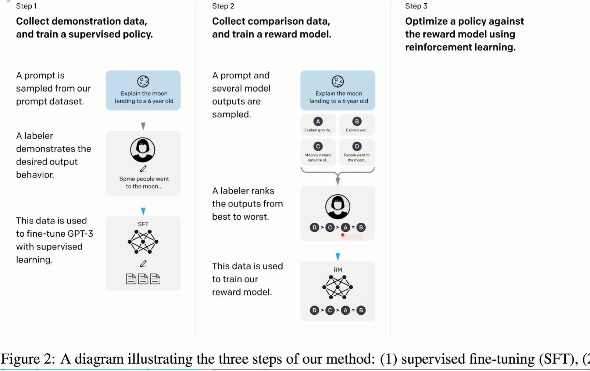
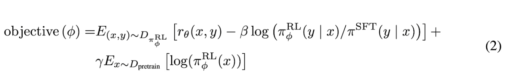

# InstructGPT

## 论文相关

- 把语言模型和人类的意图之间做align（对齐，同步）
- fine-tuning with human feedback,而不是使用标注数据(label Data)
- InstructGPT步骤（1.3B打赢了GPT3 130B的表现）
  - 人工写了很多prompt,使用标注工具将答案写出来，这样标注了一个数据集，然后使用数据集在gpt3上进行微调
  - 再收集一个数据集，对每个模型的输出，按照人类偏好标注答案准确性，再使用强化学习继续训练一个模型出来
- 使用prompt作为任务输入时可能出现以下问题
  - 捏造事实
  - 生成有偏见或者有毒的输出
  - 没有按照你想要的方法来
- 作者任务现在语言学习的目标函数不是那么对，没有和人类的意图align
- 基于人类反馈的强化学习（RLHF，reinforcement learning from human feedback）

### 模型结构

- 模型流程：
  - 设计了基于prompt训练方式的数据集，把数据集交与人类标注答案，最后使用这个数据集再GPT3进行微调(SFT)
  - 微调好的我们可称为GPT3-1,使用GPT3-1去预测第一步中的数据集的任务得到N个结果(一般使用beam search可以采样多个答案)，让标注人员标注结果的好坏，并把标注好的数据拿来训练奖励模型（RM）
  - 使用PPO来更新参数，拿GPT3-1再预测一次数据集的结果通过第二步的奖励模型进行打分，计算奖励（reward）。最后将这个奖励分数通过 PPO 给到 GPT-3-1 进行训练
- 数据集的来源：
  - prompt数据集：
    - 标注人员写了一个问题，或者写一些指令，用户提供需要OPenAI提供的应用，训练第一个instructGpT模型，然后拿到网上让一些用户体验，会将用户回答采集回来，进行筛选使用，以此来得到更多的prompt
- 模型训练过程：
  - SFT：6B的GPT3模型。使用最初人工标注的数据，训练16 epoch，虽然训练1给epoch就会过拟合，但是文章中提到过拟合没关系，甚至还有一些帮助
  - RM: 把前面模型最后的线性层去掉，并将其投影为一个值，得到一个标量
    - 模型输入是<prompt, response>这样的样子
    - 损失函数：需要将人类标准的偏好性，即一个先后顺序转换为一个值，使用排序里常见的pair wise ranking Loss，该损失函数目的是好的回答分数越高越好，不好的回答分数越低越好
  - RL（强化学习模型）：使用了PPO
    - 强化学习和统计学习的区别：在统计学习中一堆样本（x,y）在多个epoch的训练中，同一个x对应同一个y，但是强化学习中同一个x对应不同的y，这是由于模型更新发生变化了，
    - 损失函数：
      - RL policy就是GPT3这个模型，$r_\theta$ 主要是学习人类的排序，$\gamma$为0时上述目标函数对应的模型就是PPO，否则则称为PPO-ptx
