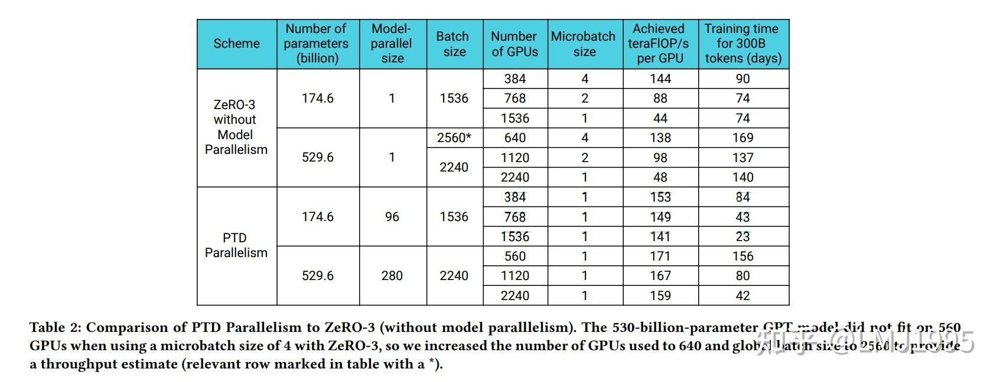

# Efficient Large-Scale Language Model Training on GPU Clusters Using Megatron-LM

## 论文相关

### 并行策略

- 一般指DP,PP,TP同时使用
  - (p,t,d)分别表示Pipeline/Tensor/Data并行的维度
  - n: GPU的总数，且有 $n = p*t*d$
  - B: global batch size
  - b: micr batch size
  - $m = B/(b*d)$: 每Pipeline中的microbatch的数量
  - eg. 假如令p=4，t=2，d=6，那么可以理解为将一个模型放在6组集群上进行数据并行加速，每一个集群内部有4条并行的流水线，且每一个流水线上使用不同的2个GPU来进行张量级别的并行计算
- 结论：
  - 对于多个GPU集群，通常建议在集群上采用流水线并行，每一个集群上的节点假如包含g个GPU卡，通常在一个节点内部采用不超过g张卡做张量并行
  - 考虑使用模型并行（包括流水线并行和张量并行）和数据并行时，通常建议在GPU内存满足的情况下最大化模型并行（t和p），然后通过数据并行技术扩展集群上进行加速
  - microbatch的选择也非常重要，取决于最终的throughput和memory，需要综合流水线并行p、数据并行d、全局BatchSize B考虑
  - Activation Recompute也是一种可以考虑的方法，在大模型训练中内存往往比算力更加宝贵，所以一种可取的方法是将一部中间过程结果丢弃，在需要时（如进行backward更新）重新计算，以节省内存
- PTDP的效果：