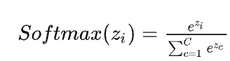
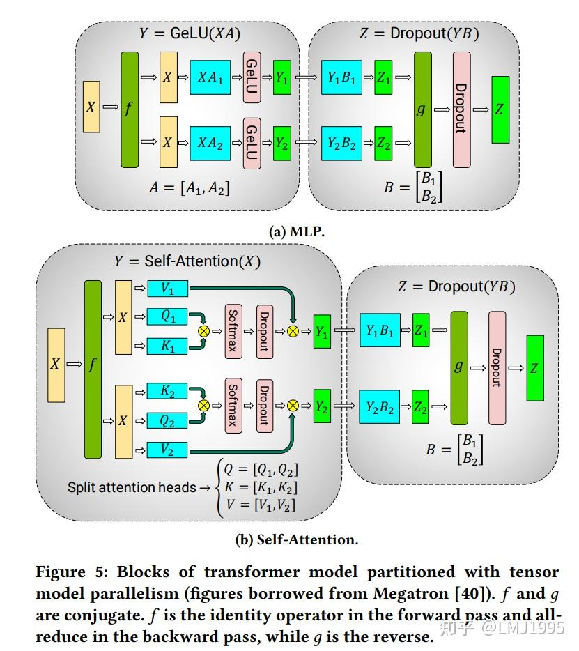

# Megatron_LM（TP）

针对语言模型,即特别大的transformer模型， Gpipe可以是transformer模型，也可以是CNN等其他类型的模型

## 论文相关

- 8.3B参数量，512个GPUs，达到 15.1 PetaFLOPs性能
- 8.3B GPT2，3.9B Bert
- petaflop/s-day： OpenAI定义神经网络中的一次乘法或者一次加法为一个操作，这一点和一般意义上的浮点运算操作FLOP略有不同。如果每秒钟可以进行10的15次方运算，也就是1 peta flops，那么一天就可以进行约10的20次方运算，这个算力消耗被称为1个petaflop/s-day
- softmax: 
  - torch.nn.Softmax(dim=1):指定某一维度的概率和为1，dim为1时，表示每一行的概率和为0

### 模型切分

- 
- MLP：假设输入$X(b*l, k)，A(k, 4*k), B(4*k, k), S=X*A, Y=S*B$， 最终输出Y大小和X输入一致
  - 如果X按行拆分，那么就是数据并行；假设A和B比较大，则应该考虑拆分A和B
  - （未采用）A进行横向拆分，那么X就应该纵向拆分，不然矩阵无法相乘，此时$X_0( b*l,k/2)*A_0(k/2,4k)=S_0(b*l,4k)$,此时$S_1$大小和$S_0$一致，需要将两者相加才能得到完成的S结果，此时会带来额外的通信开销（为什么要相加？因为矩阵相乘后一个元素的结果，需要前者一行和后者一列相乘后的和，而A进行row拆分，X进行col拆分，导致一行和一列都不完整，需要$S_1$和$S_0$对应位置元素相加才能得到S的一个完整元素）
  - A进行col拆分，此时X有完整的列，所以对X不进行拆分，即每个GPU上有完整的X的拷贝，此时$X( b*l,k)*A_0(k,4k/2)=S_0(b*l,2k)$, 此时$S_1$大小和$S_0$一致, 只需要将两者按列concat就得到完整的S。由于A进行col拆分，所以$S_0$中每一个元素的值都是前者完整的一行和后者完整的一列相乘后的和得到,不需要通信，对于Y来说，相当于S被col切分了，所以B应该按row切分
  - S按col切分了，所以B按row切分，此时$S_0(b*l,2k)*B_1(2k,k)=Y_1(b*l, k)$, 此时$Y_1$和$Y_0$大小一致，由于S按行切分，所以需要二者相加后，才能保证矩阵的每个元素都是完整的结果，此时需要矩阵通信
- 自注意力层：单个样本为例，输入$X(l,k)$,每个head的输出大小为$(l,k/h)$,h为head数目，最后会将所以head结果concat得到$(l,k)$,再乘以$O(k,k)$，最后输出大小为(l,k)
  - 由于每个head之间没有之间关联，可以并行，所以可以每个gpu放相同数目的head进行计算,此时每个GPU上有一个完整的输入拷贝
  - 所以head在未concat前可以看作被按列切分，所以此时O需要按row切分，最后将每个GPU上结果相加，此时需要进行通信
- 输入层：输入批量句子大小$X(b*l)$, 词典大小为$V(v,k)$,通过lookup得到token的emb $X(b*l, k)$
  - X不变，保持每个GPU上都有一份拷贝，V按行切分，在当前GPU未找到的结果填充0，每个GPU上$X_i(b*l, k)$大小一致，将每个GPU结果进行AllReduce得到最后结果，即此时需要进行通信
- 输出层：和输入层的词典是同一个，所以需要和输入层的切分保持一致，此时输入是$X(b*l,k)$,通过V之后得到$(b*l,v)$
  - 为什么输出大小是v?输出层大小是更新测表，要计算每个token的概率
  - 此时每个GPU都有一部分完整的输出，此时如果在softmax前相加，需要通信，大白由于词表太多进行通信代价太高，所以GPU各自计算指数的按行求和后进行通信，最后除以自己GPU上每行的指数，即可得到softmax分数，再根据label算完之后，每一行的标量做一个allreduce，就可以得到最后的损失函数了
- 代价：
  - 每个layer的输入为上层的输出时，都需要等待上层输出的allreduce完成
  - 保证多头和k能够切开，即能够被gpu整除
  - 计算和通信无法并行
- 通信量
  - 正向反向通信量一样，(b,l,k,n),n是网络层数
  - 数据并行的通信量: 把梯度发出去，把更新后的权重拿回来，梯度和权重大小一样。$O(k*k*n)$
- 思考：为什么文章中16GPU的GPU机器，只进行了8GPU的TP
  - 虽然在权重拆分上节省了内存，但是在输入X上需要保持多个拷贝，GPU越多导致这部分内存会消耗过高
