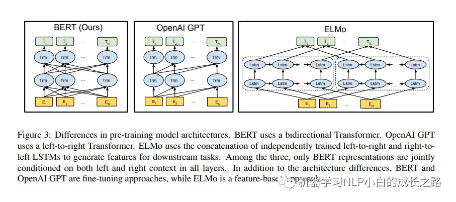

# Bert

## 论文相关

### 相关

- GPT使用左边的信息去预测未来，Bert使用左右的信息，是双向的类似完形填空
- Elmo 使用了双向信息，但是使用的比较老的结构RNN，它应用到下层的时候需要对模型结构做调整，但是bert只需要更上层就可以了，更简单
- Bert不是第一个提出预训练的文章，但是他让预训练成功出圈
- 预训练模型做特征表示的两层策略
  - feature-based: 类似Elmo，将训练好的特征作为输入，输入到下游模型
  - fine-tuning: 使用预训练好的参数，接着在下游的数据上进行训练微调一下
  - Bert认为两者的不足：
    - 使用同样的目标函数；Bert使用两个目标函数，第一个随机是将句子中的词mask，然后根据上下文预测这个词，第二个随机挑选两个句子判断是不是相邻，来学习句子层面的信息
    - 是单向的
- Bert 两阶段(以下两个步骤并bert独创，在cv已有运用)：
  - pre-training: 在没有标号的数据上进行训练
  - finee-tuning: 下游任务的模型权重被初始化为预训练好的权重，并且使用的有标号的数据集，即每个下游任务都会创建一个新的bert模型，但是使用预训练好的权重做初始化
  
### 模型结构

- 
- 只有一个编码器；由于只使用了编码器所以对于 做生成类的任务不那么方便(不方便指啥？？)，包括文章摘要，语言翻译，更多适用于分类任务
- 参数数量推导
  - emb层：假设词典大小为30K，每个token的emb大小为H
  - 自注意力层：$W_q$, $W_k$, $W_v$, 最后有个O 的投影层，大小都一样，所以学习参数为$4*H*H$
  - MLP: 投影隐藏层大小为$4*H$, 所以两个liner层学习参数加起来为$8*H*H$
  - 假设编码器有L层：总参数量为$30K*H+L*12*H*H$
- Bert的输入是一个序列，可以是句子也可以是句子对，按照一定的规则拼接在一起，这和transformer不一样，transformer的输入是序列对，它的编码和解码器都接收一个句子
- 切词方法：
  - 空格切词：导致字典特别大
  - wordPice: 切为词根（bert采用）
  - 序列开始采用CLS标记，句子中间采用SEP表示
- input emb构成：
  - 
  - segmentEmb表示这个词在哪个句子，positionEmb表示在句子中的位置，这两个都是通过学习得到；transformer中posEmb通过构造
- MASK LM
  - 可能存在问题：MASK token只能在预训练阶段存在，预测时不存在，为解决该问题，使用下面的方法
  - 15%选择非特殊token进行替换，其中80%替换为MASK符号，10%替换为随机词，10%什么都不做
  