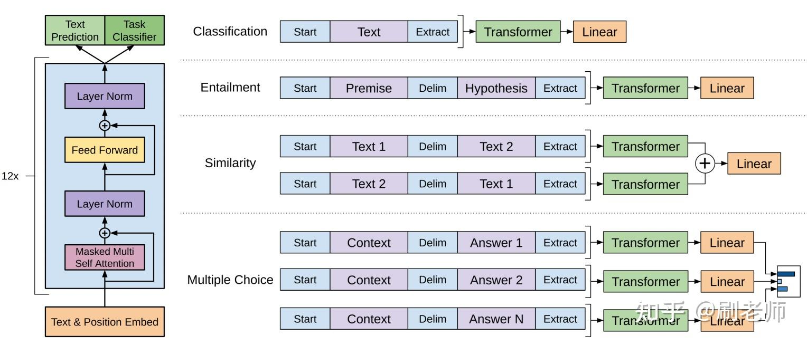
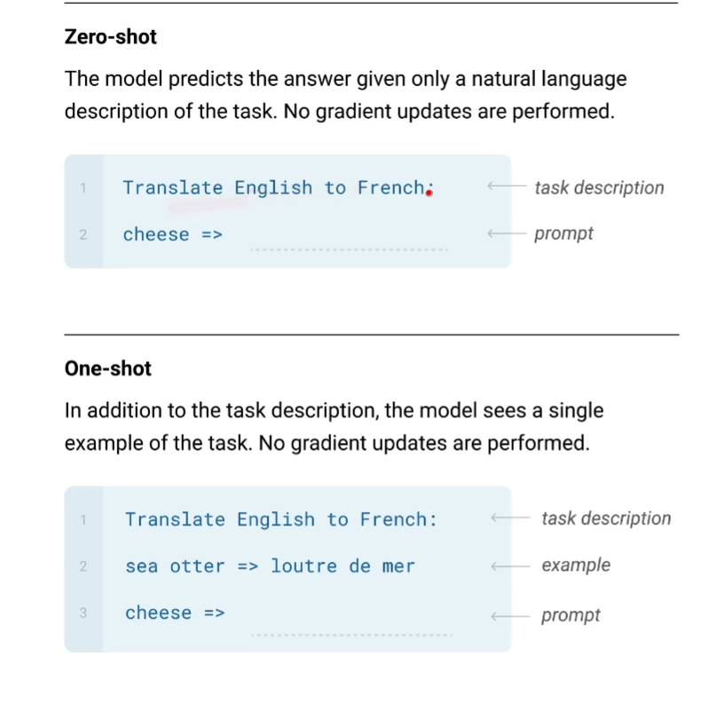

# GPT 系列

## GPT

- 只使用解码器；使用大量没有标号的数据进行预训练
- 使用无标号数据的两大问题
  - 不知道使用什么损失函数
  - 怎么把模型学到的文本表示传递到下游任务
- 半监督学习(文章中的自称，但现在大家普通称之为自监督学习)：先在没有标号的数据上进行预训练，再使用有标号的数据进行fine-tuning
- GPT是generation pre-training的简称

### 模型结构

- 无监督预训练，使用无标号数据：
  - 使用标准的语言模型的目标函数$L_1$，语言模型就是预测第i个词出现的概率，一般使用第i个词前面的k个词来预测，k为窗口大小，是一个超参数
- 自监督微调使用有标号数据：
  - 使用标准的分类目标函数$L_2$: 给你完整的序列，预测序列的标号
  - 同时使用两个目标函数$L_3=L_1 + \lambda L_2$
- 如何把MLP中很不一样的子任务表示成为我们想要微调的样子，即一个序列和一个对应的标号，注意图示，所有文本任务中使用的transformer结构不会变（论文卖点），只有不同子任务的输入构造不一样
  - 
  - 分类：判断一个文本是正例还是负例，（甚至更多类？）
    - 将文本放入中间，前面加一个初始词根Start，最后加一个抽取的词根Extract，以此做成一个序列，模型对Extract抽取的特征放入一个线性层，一般就是给liner层，如果做10分类，最后投影大小为10。（最后再softmax知道其属于某一个类别的概率？）
  - 蕴含：给一段话Premise，再给一个假设Hypothesis，判断前面的话中有没有蕴含后面的假设，给两个文本做一个三分类问题
    - 将两个文本，通过特殊字符串联为一个序列，特殊字符包括序列的起始符，两个文本的分隔符，以此最后的词根抽取符
    - eg：P: a送给b一束玫瑰。 H：a喜欢b或者a讨厌b，或者a和b是邻居。最后看P是支持H中的假设，还是不支持，还是既不支持也不反对
  - 相似：判断两个文本是不是相似
    - 由于b和a相似，也意味着a和相似，所以我们做两个序列，一个a放在前b在后，一个b在前a在后，同样每个序列通过特殊字符串联为一个序列，特殊字符包括序列的起始符，两个文本的分隔符，以此最后的词根抽取符，两个序列分别进入transformer，最后使用加法，再通过线性层
  - 多选题：给出一个句子，多个选项，选出你觉得正确的答案
    - 构建多个序列：将文本和每个选项构成一个序列，每个序列通过特殊字符串联为一个序列，特殊字符包括序列的起始符，两个文本的分隔符，以此最后的词根抽取符，每个序列分别进入transformer和liner层，最后将所有结果liner结果做一个softmax，判断正确答案的置信度

## GPT2

- 直接将模型参数量扩大为1.5B大小，但还是无法打赢Bert，所以考虑了使用zero-shot（论文卖点）的方法
- 多任务学习：
  - 单任务学习：指在每个子任务的数据集上都训练一个模型
  - 多任务学习：每次都使用多个任务的数据集进行训练，并采用多个损失函数，以此达到一个模型在多个任务上的使用，但NLP上使用不多
- GPT1和Bert：先使用大量无标号数据进行预训练，最后使用与子任务相关的标号数据集做有监督的微调，其存在问题有二
  - 每一个下游任务必须重新训练模型，即指微调
  - 必须收集对应下游任务的标号数据
- zero-shot: 每个下游任务，不再需要收集有标号的数据进行重新微调(zero-shot代表是SOTA吗？)

### 模型相关

- GPT1 在下游任务构造了输入，其中包括一些特殊字符，由于在预训练阶段使用自然语言做训练，所以特俗符号在微调前是模型不认识的，但是通过微调让模型认识了这些特殊符号
- GPT2由于使用了zero-shot不再进行微调，所以不再使用特殊符号，此时下游任务的输入应该和预训练阶段一致，类似自然语言
  - translate A to French, English，French（前面的词就是启到一个分隔符的意思，后面论文中也称为prompt）
  - answer the question, document, question, answer(answer the question就是prompt)

## GPT3

- GPT2主要使用zero-shot来满足新意度和Bert做区分，但是有效性不是很好，所以后续GPT3使用few-shot解决GPT2的有效性问题
- few-shot：给一些可控的标号样本数量，对下游任务不做微调，即不对模型参数做梯度更新（GPT3的一大特点），因为模型参数太大计算梯度代价太大
- 传统fine-tuning（没有使用在GPT3上面）: 使用有标号的数据，可以计算损失，更新梯度，模型的权重初始值使用预训练好的权重进行初始化
- zero-shot: 不需要有标号的数据，不进行微调，不做梯度更新
  - 
- one-shot: 使用了一个例子，虽然是训练数据的样子，但是不做训练，不进行梯度更新，是用来做预测的
- few-shot: 使用了多个例子，同样不做训练，不进行梯度更新，是用来做预测的
- GPT2跟GPT的区别：初始化方式改变了，把normalization放前面了
- 论文中参数越多batch_size越大，学习率越小，这和Facebook之前的论文提到的相反，使用这样学习率的原因论文中有讲（后续需要看这一块）
  - 为什么要设置大的batch_size?增加计算并行度，减少通信，小模型使用小批量，是因为小模型容易过拟合，需要使用小批量进行采样提高信噪音，但是大模型中大批量的噪音占比更小，但是影响不大，过拟合也不严重（学术界有一些探讨）

### GPT3模型结构

- 使用了Sparse Transformer类似的结构
- 数据集：Common Craw使用了3个步骤清洗数据
  - 过滤一个版本：把common craw的样本作为负例，GPT2使用的数据集作为正例，做一个二分类，会把common craw偏向正例的，认为质量比较高会留下来，否则就扔掉
  - 去重：lsh算法，判断两个集合是否相似
  - 加了一些已知的高质量数据集，比如bert，GPT2的数据集
- 数据采样：虽然common craw数据集比较多，但还是认为质量比较差，采样的概率只有60%，其余采样高质量的数据集
- 下游任务评估采用上下文学习
  - 采用K个样本，作为你的条件
  - prompt使用answer:或者A：
  - 问答时采用机器翻译常用的beam search
- 模型局限性：
  - 生成类任务比较弱：回答比较长时，可能会重复前面的回答
  - 结构和算法上的局限性：
    - 使用解码器，导致只能从前往后看，而不能重后往前看
    - 会花较多时间学习没有意义的虚词
  - 只识别了文本，没见过video，不能识别
  - 使用给出的条件做预测时，是真的从头在学习？还是直接在我学习中的样本找到相似的（作者不确信）