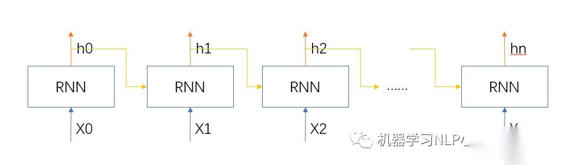
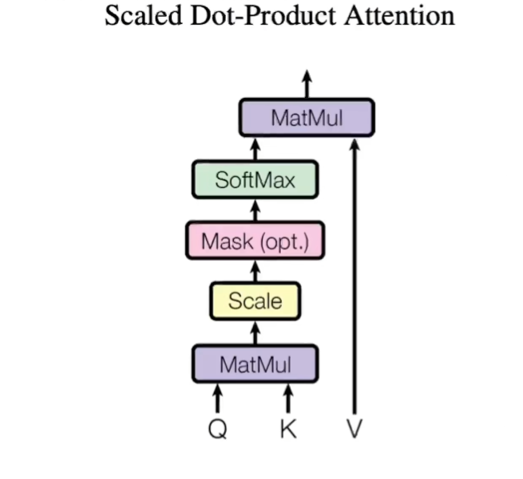
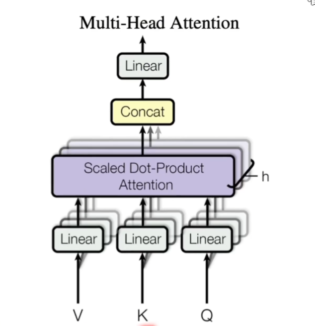

# Attention is all you need

## RNN

用于处理序列数据的经典模型, 有以下缺点：

- Sequential operations的复杂度随着序列长度的增加而增加，下一步必须等待上一步完成，等待时间为$O(N)$。
- Maximum Path length的复杂度随着序列长度的增加而增加, 前后token距离越来越大，距离为$O(N)$, 越远的token信息越难被后面的token看见。

- RNN结构：
  - rnn: xX -> H1 -> O, x为输入；$H1=X*U$; H1为隐藏层输出，U为输入到隐藏层的权重; $O=H1*V$, O为输出层输出，V为隐藏层到输出层的权重 ，到此时还是普通模型；但rnn中 $H1 = X*U + W*H1$', W就是上一次隐藏层的输出H1'到这次输出的影响权重（Note: 为了简单说明问题，偏置都没有包含在公式里面）。
  - Encoder-Decoder结构的rnn: 它先通过一个Encoder rnn网络读入所有的待翻译句子中的单词，得到一个包含原文所有信息的中间隐藏层，接着把中间隐藏层状态输入Decoder rnn网络，一个词一个词的输出翻译句子;缺陷是中间状态由于来自于输入网络最后的隐藏层，一般来说它是一个大小固定的向量，所以句子越长，需要表达的信息越多，固定向量会越丢失信息。
- 优化方向，attention主要解决以下问题：
  - 提高并行计算能力。
  - 每个token不损失信息地看见序列里的其他tokens

## 论文相关

### 模型结构

- 
- transformer结构由编码器和解码器组成。编码器可以一次性看到句子中所有的词，解码器是一个词一个词的输出，使用了自回归（auto-regress），当前输出是下一个输出的输入。
- Encoder结构：N个相同的layer, 每个layer包括2个module，一个为multi-head attention，一个为FNN（其实就是MLP），中间有加上一些残差链接，当前layer输出为一下layer输入。
  - batchNorm: 以$M*N$大小的输入为例，表示有M个样本，每个样本有N个特征，那么每一行对应一个样本，每一列对应这批样本的一个特征，batchNorm将这个mini-batch的feature变为均值为0方差为1，其中均值和方差为超参数，可以进行调整
  - layerNorm：同样以$M*N$大小的输入为例，输入含义同上，但是layerNorm是对每一行做处理，即让每个样本处理为均值为0方差为1，其中均值和方差为超参数，可以进行调整；对于二维的layerNorm而言，可以直接将输入转置传入batchNorm得到结果，再将结果转置就可得到所需
  - 为什么transformer中多用layerNorm ？是因为对于真实输入来说(N,l,d), 每个句子长度不一样，使用batchNorm需要将短的填充为0再进行计算，当句子长度差异很大的时候，每个mini-batch的均值和方差抖动比较大；另一个问题是batchNorm需要存储一个全局的均值和方差，预测时候遇到更长的句子，如果训练没有遇到过，那么训练的均值和方差就不是那么适应了；而layerNorm是针对每个样本计算的，不需要存储全局的均值和方差，相对而言更加稳定（论文中的解释，但后续有其他论文从其他角度讨论了他的作用）
- Decoder结构：N 个同样的层构成，每个层有mask-attention, multi-head attention, FNN三个子层。当前layer输出为一下layer输入。

### self-Attention

- 
- Q,K,V（query, key, value）：output是V的一个加权和，所以维度和V一致，加权权重是由Q, K的相似度决定的，一般有多种不同的相似度函数，导致不一样的注意力版本。
- 本文使用scaled Dot-product Attention,  $a_{ij}=SoftMax(\frac{Q_iK_j^T}{\sqrt{d_k}})$: 矩阵相乘表示一个矩阵在另一个矩阵上的投影，表示相关性，而${Q_iK_j^T}$，就表示了${Q_i}$和${K_j^T}$的相关性，即第i给query和第j给key的相关性，使用softmax是归一化，实验${\sqrt{d_k}})$的目的将方差和将${d_k}$解耦, 否则${d_k}较大时，会导致大的值计算出来更靠近1，其余更靠近0，梯度会很小。
- 其实Mask部分，是在softmax之前将t时候后面不该看到的值，置为很小的负数，这样在softmax之后占用的权重就特别小，以此保证t时刻后面的词不会影响当前输出。
- attention模块的主要作用是将序列中我感兴趣的东西，抓取出来

### Multi-Head Attention

- 
- 学习参数主要就是liner中的参数，即每个attention中的$W_q$, $W_k$,$W_v$
- 使用多个head主要是模拟CNN中的多通道效果

### FNN

- 其实就是两个MLP，主要是做一个语义空间的转换

### positional encoding

- 添加该层是因为attention中没有时序信息
