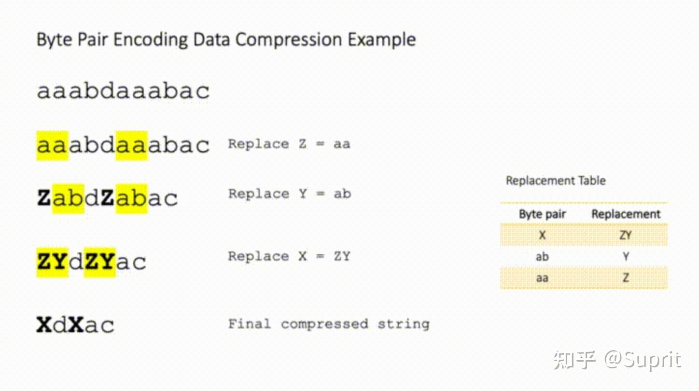

# 分词算法

## 传统分词

- 古典分词
  - 一般分为：按照规则，按照空格，按照标点
  - 缺陷'
    - 对于未在词表中出现的词（Out Of Vocabulary, OOV ），模型将无法处理（未知符号标记为 [UNK]）。
    - 词表中的低频词/稀疏词在模型训无法得到训练（因为词表大小有限，太大的话会影响效率）
    - 很多语言难以用空格进行分词，例如英语单词的多形态,一方面增加了训练冗余，另一方面也造成了大词汇量问题(最主要)
- 拆分为单个字符，虽然解决了OOV问题，但有以下问题：
  - 粒度太细，训练花费的成本太高

## BERT带来的分词方法

- 基于子词的分词方法（Subword Tokenization）：目的是通过一个有限的词表 来解决所有单词的分词问题，同时尽可能将结果中 token 的数目降到最低，与传统方法相比，既可以解决OOV问题，也可以解决单词不同时态的问题，其Subword 粒度在词与字符之间，粒度不会太细也不会太粗
- 三种主流的 Subword 算法
  - Byte Pair Encoding (BPE)： digram coding 双字母组合编码，是一种数据压缩算法，用来在固定大小的词表中实现可变⻓度的子词，一般取频数最高的单元对合并成新的Subword单元
    - 
    - 算法过程：
      - 准备语料库，确定期望的 subword 词表大小等参数
      - 通常在每个单词末尾添加后缀 </w>，统计每个单词出现的频率，例如，low 的频率为 5，那么我们将其改写为 "l o w </ w>”：5。注：停止符 </w> 的意义在于标明 subword 是词后缀。举例来说：st 不加 </w> 可以出现在词首，如 st ar；加了 </w> 表明该子词位于词尾，如 we st</w>，二者意义截然不同
      - 将语料库中所有单词拆分为单个字符，用所有单个字符建立最初的词典，并统计每个字符的频率，本阶段的 subword 的粒度是字符
      - 挑出频次最高的符号对 ，比如说 t 和 h 组成的 th，将新字符加入词表，然后将语料中所有该字符对融合（merge），即所有 t 和 h 都变为 th。注：新字符依然可以参与后续的 merge，有点类似哈夫曼树，BPE 实际上就是一种贪心算法 。
      - 重复遍历 2 和 3 操作，直到词表中单词数达到设定量 或下一个最高频数为 1 ，如果已经打到设定量，其余的词汇直接丢弃。注：看似我们要维护两张表，一个词表，一个字符表，实际上只有一张，词表只是为了我们方便理解。
    - BPE 一般适用在欧美语言拉丁语系中，因为欧美语言大多是字符形式，涉及前缀、后缀的单词比较多。中文的汉字一般不用 BPE 进行编码，因为中文是字无法进行拆分。对中文的处理通常只有分词和分字两种。理论上分词效果更好，更好的区别语义
  - WordPiece（Bert使用）：和BEP类似，与BPE的最大区别在于，如何选择两个子词进行合并：BPE选择频数最高的相邻子词合并，而WordPiece选择能够提升语言模型概率最大的相邻子词加入词表
    - 句子$S=(t_1,t_2,...,t_n)$, $t_i$表示子词，且假设各个子词之间是独立存在的，则句子的语言模型似然值等价于所有子词概率的乘积: $logP(S)= \sum_{i=1}^{n}logP(t_i)$,相邻位置的x和y两个子词进行合并，合并后产生的子词记为z，此时句子似然值的变化可表示为: $logP(t_z)-(logP(t_x)+logP(t_y))=log\frac{logP(t_z)}{logP(t_x)+logP(t_y)}$
    - 似然值的变化就是两个子词之间的互信息。简而言之，WordPiece每次选择合并的两个子词，他们具有最大的互信息值，也就是两子词在语言模型上具有较强的关联性，它们经常在语料中以相邻方式同时出现
  - Unigram Language Model(ULM):暂时不看